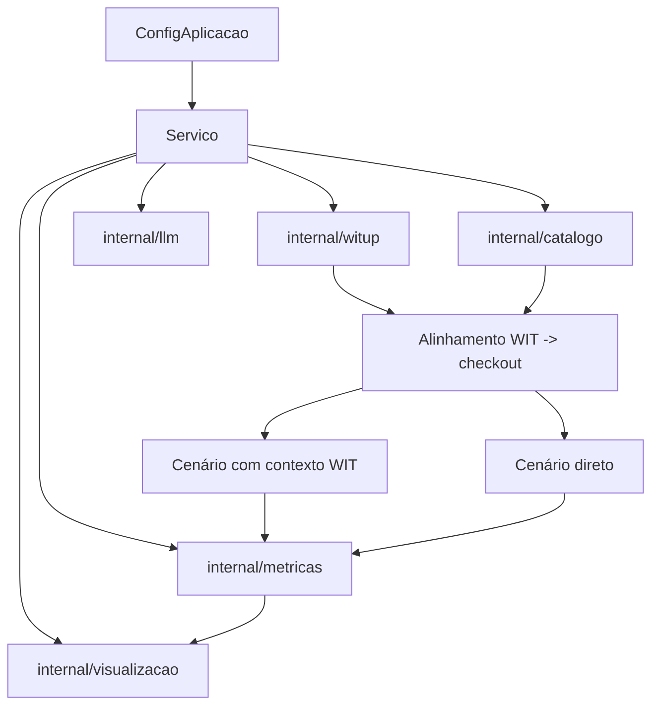

# Arquitetura

A fase nova foi organizada para manter um núcleo simples:

- carregar baseline WIT local;
- alinhar ao checkout;
- comparar dois cenários de geração;
- exportar resultados em formatos legíveis.

## Blocos principais

| Pacote | Responsabilidade |
| :--- | :--- |
| `internal/dominio` | Tipos de configuração, análise, geração, avaliação e fase dois |
| `internal/aplicacao` | Orquestra a execução ponta a ponta |
| `internal/catalogo` | Descobre métodos Java no checkout |
| `internal/llm` | Cliente de completions/Responses API |
| `internal/metricas` | Executa as métricas da Parte 2 |
| `internal/visualizacao` | Gera o dashboard HTML |
| `internal/witup` | Lê os artefatos WIT em JSON |

## Fluxo interno

## Arquivos novos mais importantes da segunda fase

- [`/Users/marceloamorim/Documents/unb/witup-llm/internal/aplicacao/servico_segunda_fase.go`](/Users/marceloamorim/Documents/unb/witup-llm/internal/aplicacao/servico_segunda_fase.go)
- [`/Users/marceloamorim/Documents/unb/witup-llm/internal/aplicacao/comandos_segunda_fase.go`](/Users/marceloamorim/Documents/unb/witup-llm/internal/aplicacao/comandos_segunda_fase.go)
- [`/Users/marceloamorim/Documents/unb/witup-llm/internal/aplicacao/segunda_fase_exportacao.go`](/Users/marceloamorim/Documents/unb/witup-llm/internal/aplicacao/segunda_fase_exportacao.go)
- [`/Users/marceloamorim/Documents/unb/witup-llm/internal/visualizacao/segunda_fase.go`](/Users/marceloamorim/Documents/unb/witup-llm/internal/visualizacao/segunda_fase.go)

## Decisão arquitetural importante

O fluxo novo trabalha diretamente com:

- baselines WIT locais;
- JSON intermediário;
- CSV consolidado;
- dashboard HTML.

Isso reduziu o acoplamento operacional da segunda fase e deixou o experimento mais fácil de explicar e reproduzir.
