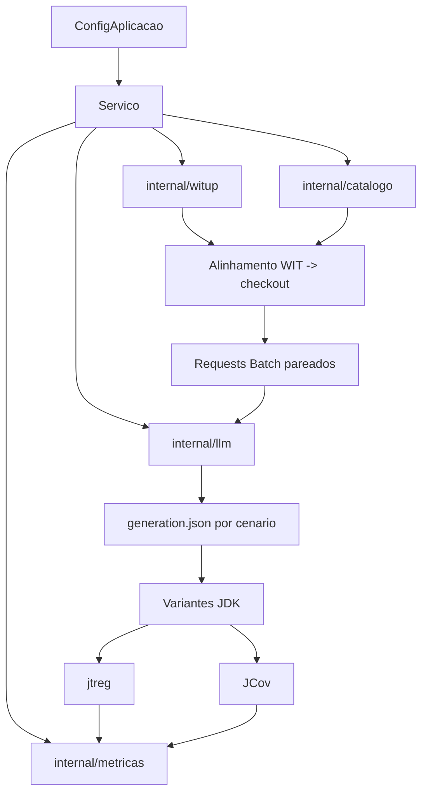

# Arquitetura

A arquitetura atual separa tres preocupacoes: preparar a comparacao pareada, gerar testes via Batch API e medir impacto no JDK.

- carregar baseline WIT local;
- alinhar ao checkout;
- comparar dois cenários de geração;
- materializar variantes do projeto;
- medir `jtreg`, JCov e metricas de excecao.

## Blocos principais

| Pacote | Responsabilidade |
| :--- | :--- |
| `internal/dominio` | Tipos de configuração, análise, geração, avaliação, Batch e JDK |
| `internal/aplicacao` | Orquestra a execução ponta a ponta |
| `internal/catalogo` | Descobre métodos Java no checkout |
| `internal/llm` | Cliente Responses API e OpenAI Batch API |
| `internal/metricas` | Executa e extrai métricas locais |
| `internal/visualizacao` | Gera o dashboard HTML |
| `internal/witup` | Lê os artefatos WIT em JSON |

## Fluxo interno

## Fluxo JDK

1. `preparar-estudo-jdk-global` cataloga o JDK, alinha o WIT e gera JSONL Batch.
2. `submit-openai-batch` envia os prompts para a OpenAI.
3. `collect-openai-batch` baixa respostas e erros.
4. `avaliar-estudo-jdk-global` materializa `baseline`, `wit-context` e `direct-tests`.
5. `medir-impacto-jdk-global` executa `jtreg` nas variantes.
6. Scripts auxiliares consolidam JCov e metricas de excecao.

## Decisão arquitetural importante

O fluxo usa artefatos simples e auditaveis:

- baselines WIT locais;
- JSON intermediário;
- CSV consolidado;
- Markdown para relato de resultados;
- diretorios de variantes para reproducao.

Isso deixa a comparacao WIT vs direto rastreavel: mesmos metodos-alvo, mesmo modelo, mesmo numero de chamadas, e avaliacao local sobre variantes materializadas.
