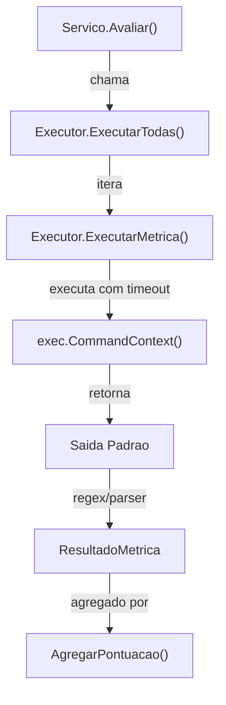
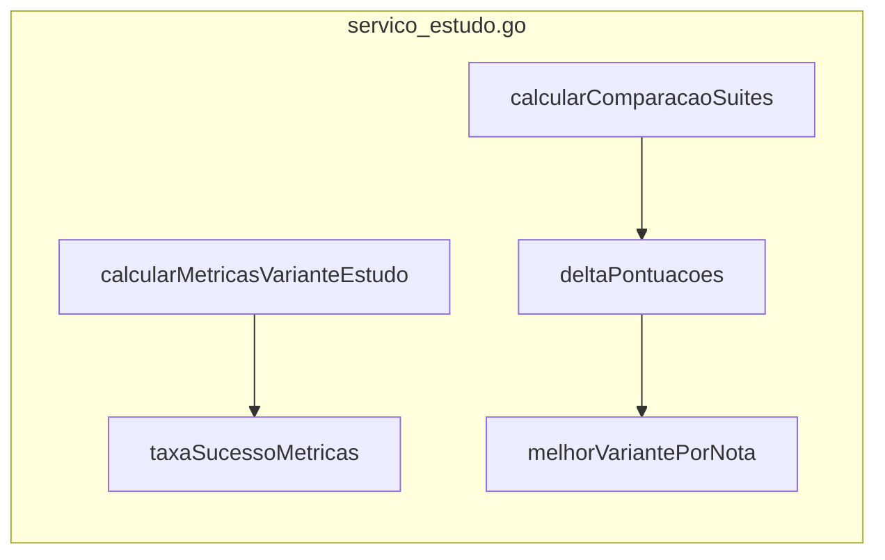

# Executor de Metricas

O `Executor` em `internal/metricas` e responsavel por medir qualidade, corretude e cobertura das suites de teste geradas.

## Fluxo de Execucao



## Metodos de Extracao

### 1. Extracao por Regex
Se `value_regex` esta definido na `ConfigMetrica`, o executor busca o primeiro
match na saida do comando. Usado para extrair contagens de testes ou tempos de
execucao.

Cada tentativa respeita `timeout_seconds`. Quando omitido, o padrao e 600
segundos. Fallbacks herdam esse valor da metrica principal, mas podem
sobrescrever com um limite proprio.

### 2. Parsing JaCoCo XML
`ExtrairCoberturaJaCoCo` parseia `jacoco.xml` e calcula:
```
cobertura = covered / (missed + covered) * 100
```
Foca no counter `LINE` no nivel raiz do relatorio.

### 3. Parsing PIT Mutations XML
`ExtrairMutacaoPIT` processa `mutations.xml`:
- Conta total de `<mutation>`
- Compara com `detected="true"`
- Calcula score de mutacao

### 4. Cobertura JCov no JDK

Na rodada JDK, a cobertura estrutural principal vem do JCov. O relatorio consolidado usa um escopo fixo de classes para comparar as variantes com o mesmo denominador:

- linha;
- branch;
- bloco JCov;
- metodo;
- classe.

JCov 3.0 usa mascaras separadas por `|` no parametro `include`, nao regex Java completo. Por isso, filtros como `java.(lang|io).*` nao devem ser usados diretamente.

### 5. Metricas de excecao

A rodada JDK tambem extrai metricas retrospectivas a partir do manifesto WIT, dos `generation.json` materializados e dos `.jtr` do jtreg:

- `Exception Assertion Rate`: proporcao de metodos cujos testes gerados verificam excecoes explicitamente;
- `Passing Exception Test Rate`: proporcao desses testes que passaram no jtreg;
- `Approximate Exception Path Coverage`: proporcao aproximada de expaths usados ou adaptados;
- tipos unicos de excecao exercitados/verificados.

Essas metricas nao provam que o bytecode exato do `throw` foi executado. Elas medem se a geracao codificou comportamento excepcional de forma observavel.

## Pontuacao e Agregacao

| Funcao | Responsabilidade |
| :--- | :--- |
| `AgregarPontuacao` | Soma `(Valor * Peso)` para metricas bem-sucedidas, divide pela soma dos pesos |
| `CombinarPontuacoes` | Combina Score de Metricas com Score do Judge LLM (se disponivel) |
| `FormatarPontuacao` | Formata float64 como percentual (ex: "85.50%") |

## Medicao de Reproducao de Excecao

Verifica se um teste gerado reproduz com sucesso um ExPath especifico:
- Escaneia saida de execucao do teste buscando o tipo de excecao e stack trace definidos no `CaminhoExcecao`
- Integrado como metrica especifica no pipeline de avaliacao

## Integracao com Variantes



## Funcoes Chave

| Arquivo | Funcao | Proposito |
| :--- | :--- | :--- |
| `executor.go` | `ExecutarTodas` | Loop principal de execucao de metricas |
| `extratores.go` | `ExtrairCoberturaJaCoCo` | Parseia XML JaCoCo |
| `extratores.go` | `ExtrairMutacaoPIT` | Parseia XML PIT |
| `agregador.go` | `AgregarPontuacao` | Media ponderada dos resultados |
| `servico_avaliacao.go` | `Avaliar` | Servico de alto nivel que chama o executor |
