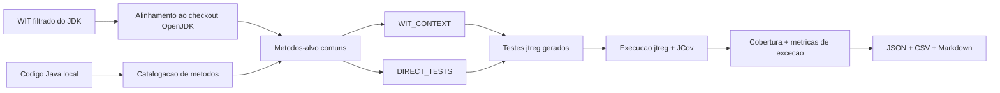

# wit-llm

`wit-llm` e uma CLI em Go para estudar geracao de testes Java com LLMs. O foco atual e comparar testes gerados com **contexto WIT** contra testes gerados diretamente do codigo, medindo o impacto em um projeto real de grande porte: o OpenJDK/JDK.

## Escopo atual

- Projeto alvo: **OpenJDK/JDK**
- Analise estatica: **What Is Thrown (WIT)**
- Geracao: `WIT_CONTEXT` vs `DIRECT_TESTS`
- Execucao: `jtreg`
- Cobertura: **JCov**

## O que a ferramenta faz agora

Para o JDK:

1. carrega o `wit_filtered.json` do WIT;
2. alinha os metodos WIT ao checkout do OpenJDK;
3. seleciona um conjunto comum de metodos-alvo;
4. gera testes em dois cenários:
   - `WIT_CONTEXT`
   - `DIRECT_TESTS`
5. integra os testes gerados na suite `jtreg`;
6. mede cobertura estrutural com JCov;
7. calcula metricas de excecao;
8. materializa os resultados em:
   - `JSON`
   - `CSV`
   - `Markdown`

## Fluxo resumido

## Resultado preliminar JDK 200

Na rodada atual com 200 metodos-alvo do JDK:

- `WIT_CONTEXT` melhorou cobertura de linhas em **+3.09 p.p.** contra o baseline.
- `DIRECT_TESTS` melhorou cobertura de linhas em **+3.36 p.p.** contra o baseline.
- `WIT_CONTEXT` alcancou **17/17 classes-alvo**.
- `DIRECT_TESTS` alcancou **16/17 classes-alvo**.
- `WIT_CONTEXT` gerou verificacoes explicitas de excecao em **94%** dos metodos.
- `DIRECT_TESTS` gerou verificacoes explicitas de excecao em **59%** dos metodos.

Veja a pagina [Impacto Global no JDK](studies/jdk-global-impact.md) para os detalhes.

## Páginas recomendadas

-   **Primeiros Passos**

    ---

    Como preparar o ambiente, compilar a CLI e rodar o fluxo JDK.

    [**Abrir**](overview/getting-started.md)

-   **Configuração**

    ---

    Estrutura do `pipeline.json` e modelos de LLM.

    [**Abrir**](overview/configuration.md)

-   **CLI**

    ---

    Comandos principais para Batch, JDK e metricas.

    [**Abrir**](cli/index.md)

-   **Arquitetura**

    ---

    Visao de como WIT, LLM, Batch, jtreg e JCov se conectam.

    [**Abrir**](architecture/index.md)

-   **Harness**

    ---

    Como Codex deve navegar, validar e evoluir o projeto.

    [**Abrir**](harness/index.md)

-   **Exec Plans**

    ---

    Planos para mudanças maiores, dívida técnica e decisões em andamento.

    [**Abrir**](exec-plans/index.md)

