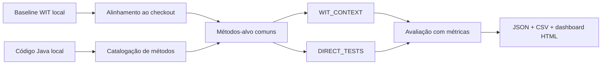

# witup-llm

`witup-llm` entrou em uma fase mais enxuta do estudo: agora a comparação principal é entre **geração de testes com contexto WIT** e **geração direta sem contexto WIT**, usando dois projetos-alvo.

## Escopo atual

- **Google Guava**
- **Apache Commons Collections**

## O que a ferramenta faz agora

Para cada projeto:

1. carrega um baseline WIT local;
2. alinha esse baseline ao checkout atual;
3. fixa um conjunto comum de métodos-alvo;
4. gera testes em dois cenários:
   - `WIT_CONTEXT`
   - `DIRECT_TESTS`
5. avalia as suítes com métricas Java;
6. materializa os resultados em:
   - `JSON`
   - `CSV`
   - `HTML`

## Fluxo resumido

## Artefatos finais

- `phase-two-study.json`
- `csv/phase-two-summary.csv`
- `csv/phase-two-metrics.csv`
- `csv/phase-two-comparison.csv`
- `dashboard.html`

## Páginas recomendadas

-   **Primeiros Passos**

    ---

    Como preparar o ambiente e rodar a segunda fase.

    [**Abrir**](overview/getting-started.md)

-   **Configuração**

    ---

    Estrutura do `pipeline.json`, incluindo `phase_two.projects`.

    [**Abrir**](overview/configuration.md)

-   **CLI**

    ---

    Comandos principais da fase nova.

    [**Abrir**](cli/index.md)

-   **Arquitetura**

    ---

    Visão de como a segunda fase foi organizada no código.

    [**Abrir**](architecture/index.md)

-   **Harness**

    ---

    Como Codex deve navegar, validar e evoluir o projeto.

    [**Abrir**](harness/index.md)

-   **Exec Plans**

    ---

    Planos para mudanças maiores, dívida técnica e decisões em andamento.

    [**Abrir**](exec-plans/index.md)

