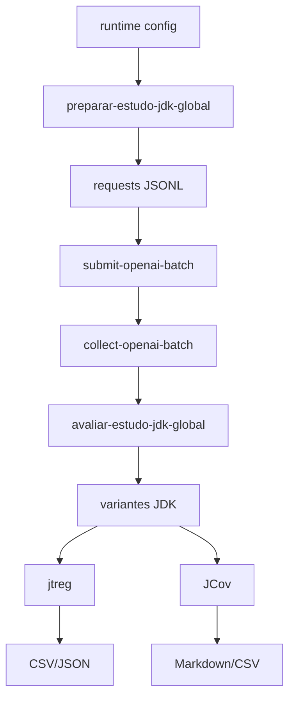

# Referencia de Configuracao

O `wit-llm` usa arquivos JSON como configuracao central.
Ele define:

- o projeto Java-alvo;
- o fluxo de execucao;
- os modelos LLM;
- as metricas executadas na Parte 2;
- opcionalmente, o escopo da segunda fase do estudo.

Na rodada JDK, os scripts usam principalmente `generated/configs/rodada-artigo.runtime.json` para configurar modelos e o checkout JDK e informado por variavel de ambiente ou flag da CLI.

## Estrutura Geral

```json
{
  "version": "1",
  "project": { ... },
  "pipeline": { ... },
  "models": { ... },
  "metrics": [ ... ],
  "phase_two": { ... }
}
```

## 1. Projeto (`project`)

Define o checkout Java usado pelo fluxo atual.

| Campo | Tipo | Descricao |
| :--- | :--- | :--- |
| `root` | `string` | Raiz do projeto Java |
| `include` | `string[]` | Subcaminhos preferidos para catalogacao |
| `exclude` | `string[]` | Subcaminhos ignorados na copia/catalogacao |
| `overview_file` | `string` | Arquivo de visao geral usado nos prompts |
| `test_framework` | `string` | `infer`, `junit4` ou `junit5` |

## 2. Pipeline (`pipeline`)

Controla o comportamento geral do experimento.

| Campo | Tipo | Descricao |
| :--- | :--- | :--- |
| `output_dir` | `string` | Diretorio-raiz dos artefatos |
| `replication_root` | `string` | Pasta com o pacote de replicacao WIT |
| `baseline_file` | `string` | Nome do baseline WIT no pacote legado |
| `save_prompts` | `bool` | Salva prompts e respostas brutas |
| `max_methods` | `int` | Limita metodos catalogados; `0` significa sem limite |
| `judge_model` | `string` | Modelo juiz opcional |
| `llm_mode` | `string` | `direct` ou `multiagent` |
| `deep_validation_subset_size` | `int` | Tamanho do subconjunto para refino extra |

O fluxo atual gera artefatos em `JSON`, `CSV` e `HTML` diretamente no diretório
de saída configurado.

## 3. Modelos (`models`)

Cada entrada descreve um endpoint LLM configurado.

| Campo | Tipo | Descricao |
| :--- | :--- | :--- |
| `provider` | `string` | `openai_compatible` ou `ollama` |
| `model` | `string` | Nome do modelo remoto |
| `base_url` | `string` | URL base da API |
| `api_key_env` | `string` | Variavel de ambiente com a chave |
| `temperature` | `float` | Temperatura de amostragem |
| `timeout_seconds` | `int` | Timeout da requisicao |
| `max_retries` | `int` | Tentativas para erros transientes |
| `reasoning_effort` | `string` | `none`, `low`, `medium`, `high`, `xhigh` |
| `prompt_cache_retention` | `string` | Janela de retencao do cache |
| `service_tier` | `string` | `auto`, `default`, `flex` ou `priority` |
| `max_output_tokens` | `int` | Limite opcional de saida |

## 4. Metricas (`metrics`)

Cada metrica executa um comando shell na sandbox do projeto avaliado.

| Campo | Tipo | Descricao |
| :--- | :--- | :--- |
| `name` | `string` | Identificador da metrica |
| `kind` | `string` | Classe logica da metrica (`tests`, `coverage`, `mutation`, etc.) |
| `command` | `string` | Comando principal |
| `weight` | `float` | Peso na agregacao |
| `value_regex` | `string` | Regex para extrair o valor numerico |
| `scale` | `float` | Escala maxima para normalizacao |
| `working_directory` | `string` | Subdiretorio dentro da sandbox |
| `timeout_seconds` | `int` | Limite maximo por tentativa. Padrao: 600 segundos |
| `expected_outputs` | `string[]` | Artefatos obrigatorios para considerar a metrica valida |
| `description` | `string` | Texto descritivo da metrica |
| `fallbacks` | `object[]` | Tentativas alternativas executadas em ordem |

Os fallbacks sao importantes para a Parte 2 porque permitem reaproveitar
artefatos de JaCoCo ou PIT quando a etapa principal gera relatorio mas termina
com erro no processo Maven.

Fallbacks herdam `timeout_seconds` da metrica principal, mas podem declarar um
limite proprio. Uma tentativa que excede o limite fica com `timed_out=true`,
`exit_code=124` e nao contribui com pontuacao.

## 5. Segunda fase (`phase_two`)

Define o novo protocolo focado em comparacao de geracao de testes com e sem
contexto WIT.

| Campo | Tipo | Descricao |
| :--- | :--- | :--- |
| `execution_mode` | `string` | `strict_1call` ou `repair_1retry` |
| `visualization_title` | `string` | Titulo do dashboard HTML |
| `projects` | `object[]` | Lista de projetos-alvo da segunda fase |

`execution_mode` controla a simetria entre os cenarios:

- `strict_1call`: faz exatamente uma chamada de geracao por cenario;
- `repair_1retry`: permite no maximo um reparo adicional por cenario quando a suite falha em compilacao/execucao. Este e o padrao atual.

Cada entrada em `phase_two.projects` possui:

| Campo | Tipo | Descricao |
| :--- | :--- | :--- |
| `key` | `string` | Identificador estavel do projeto |
| `label` | `string` | Rotulo amigavel para CSV/dashboard |
| `root` | `string` | Checkout local do projeto |
| `wit_analysis_path` | `string` | Baseline WIT local em JSON |
| `overview_file` | `string` | Arquivo de contexto do projeto |
| `include` | `string[]` | Overrides de include |
| `exclude` | `string[]` | Overrides de exclude |
| `test_framework` | `string` | Override do framework de testes |

## Exemplo usado no fluxo JDK

```json
{
  "version": "1",
  "project": {
    "root": "/Users/marceloamorim/Documents/unb/jdk",
    "include": ["src"],
    "exclude": [".git", "build", "generated", "images", "support"],
    "test_framework": "jtreg"
  },
  "pipeline": {
    "output_dir": "./generated/experiments/jdk-global-impact-study",
    "save_prompts": true,
    "llm_mode": "direct"
  },
  "models": {
    "openai_main": {
      "provider": "openai_compatible",
      "model": "gpt-5.4-mini",
      "base_url": "https://api.openai.com/v1",
      "api_key_env": "OPENAI_API_KEY",
      "reasoning_effort": "medium",
      "execution_backend": "batch",
      "endpoint": "/v1/responses"
    }
  },
  "metrics": []
}
```

## Saidas do fluxo JDK

Ao preparar, coletar e avaliar uma rodada JDK, o projeto gera:

- `preparation_jdk_global_impact.json`
- `analysis_jdk_wit_filtered_sample.json`
- `manifest_jdk_global_methods.csv`
- `requests_*_openai_batch_generation.jsonl`
- `responses_openai_batch_generation.jsonl`
- `results_jdk_global_impact.json`
- `results_jdk_global_jtreg_summary.csv`
- `results_jdk_jcov_200_fast_summary.csv`
- `results_jdk_exception_coverage_metrics.csv`

## Mapa rapido da execucao


