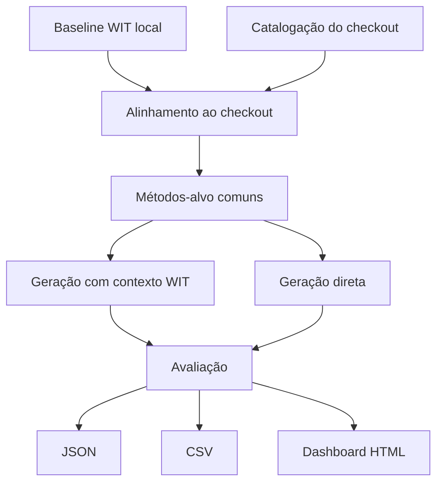

# Visao Geral

A fase atual do `witup-llm` compara duas estratégias de geração de testes unitários:

- **WIT_CONTEXT**: o baseline WIT entra como contexto para a geração;
- **DIRECT_TESTS**: os testes são pedidos diretamente ao modelo, sem contexto WIT.

## Por que essa mudança

A fase anterior misturava vários objetivos experimentais, três variantes de expaths e uma camada analítica extra. Para a nova etapa, o foco foi reduzido para uma pergunta mais clara:

> usar o contexto WIT realmente melhora a qualidade dos testes em relação à geração direta?

## Projetos-alvo

- Google Guava
- Apache Commons Collections

## Unidade de comparação

Os dois cenários são avaliados sobre o **mesmo conjunto de métodos-alvo** por projeto. Isso evita comparar estratégias em subconjuntos diferentes do código.

## Pipeline da segunda fase

## Métricas principais

- `test-compilation`
- `unit-tests`
- `test-pass-rate`
- `target-method-coverage`
- `assertive-tests-rate`
- `exception-assertion-rate`
- `jacoco-line`
- `jacoco-branch`
- `pit-mutation`

## Saída esperada

Ao final da execução, o projeto produz um pacote legível para análise:

- um relatório consolidado em JSON;
- tabelas CSV para comparação;
- um dashboard HTML estático para apresentação.
