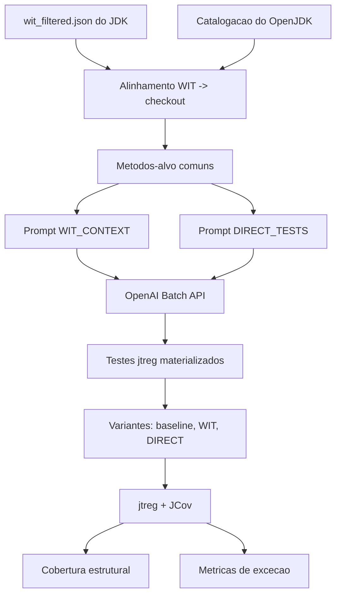

# Visao Geral

A fase atual do `wit-llm` compara duas estrategias de geracao de testes Java com LLM:

- **WIT_CONTEXT**: o baseline WIT entra como contexto para a geração;
- **DIRECT_TESTS**: os testes são pedidos diretamente ao modelo, sem contexto WIT.

## Ideia

What Is Thrown (WIT) infere pre-condicoes relacionadas a excecoes em programas Java. O projeto usa esses caminhos excepcionais como sinal estruturado para orientar o LLM na geracao de testes de regressao.

A pergunta central e:

> caminhos excepcionais precomputados por analise estatica ajudam LLMs a gerar testes mais focados em comportamento excepcional?

## Projetos-alvo

- foco atual: **OpenJDK/JDK**;
- repositorio operacional: `https://github.com/openjdk/jdk`;
- baseline local: `resources/wit-replication-package/data/output/jdk/wit_filtered.json`.

## Unidade de comparação

Os dois cenarios sao avaliados sobre o **mesmo conjunto de metodos-alvo**. A unidade principal da rodada JDK e o impacto global no projeto, mas a analise por metodo continua existindo para explicar os ganhos, falhas e uso de expaths.

## Pipeline atual

## Métricas principais

- cobertura JCov de linha, branch, bloco, metodo e classe;
- execucao `jtreg`: pass, fail, error;
- `Exception Assertion Rate`;
- `Passing Exception Test Rate`;
- `Approximate Exception Path Coverage`;
- uso/adaptacao dos expaths WIT.

## Saída esperada

Ao final da execução, o projeto produz um pacote legível para análise:

- um relatório consolidado em JSON;
- tabelas CSV para comparação;
- relatorios Markdown para apresentacao;
- testes gerados materializados nas variantes do JDK.
