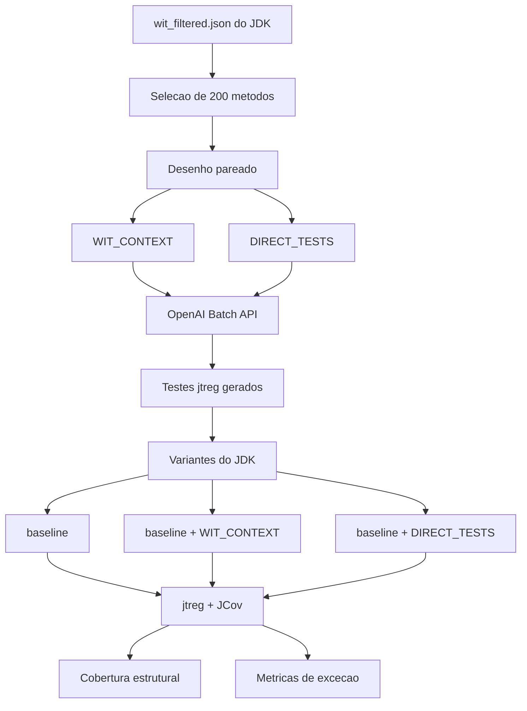

# Impacto Global no JDK

Esta pagina resume a rodada atual do `wit-llm` sobre o OpenJDK/JDK. O objetivo e medir o impacto de testes gerados por LLM quando integrados a suite `jtreg` do projeto.

## Desenho experimental

- Projeto alvo: OpenJDK/JDK.
- Repositorio operacional: `https://github.com/openjdk/jdk`.
- Baseline WIT: `resources/wit-replication-package/data/output/jdk/wit_filtered.json`.
- Metodos-alvo da rodada: 200.
- Cenarios:
  - `WIT_CONTEXT`: prompt com codigo do metodo e expaths WIT.
  - `DIRECT_TESTS`: prompt com codigo do metodo, sem contexto WIT.
- Execucao: testes materializados como testes `jtreg`.
- Cobertura: JCov em escopo fixo de 17 classes.

## Cobertura JCov

| Variante | Linha | Branch | Bloco (JCov) | Metodo | Classe |
| :--- | ---: | ---: | ---: | ---: | ---: |
| Baseline | 17.9895% | 16.6934% | 16.3265% | 26.7937% | 88.2353% |
| WIT_CONTEXT | 21.0749% | 18.9807% | 18.3978% | 30.2691% | 100.0000% |
| DIRECT_TESTS | 21.3486% | 20.1445% | 19.0070% | 31.9507% | 94.1176% |

O escopo fixo contem 17 classes esperadas a partir do manifesto dos 200 metodos. Classes ausentes no `result.xml` de uma variante entram com cobertura zero e denominador recuperado da variante onde a classe apareceu.

### Deltas contra baseline

| Metrica | WIT_CONTEXT | DIRECT_TESTS |
| :--- | ---: | ---: |
| Linha | +3.0853 p.p. | +3.3590 p.p. |
| Branch | +2.2873 p.p. | +3.4510 p.p. |
| Bloco | +2.0713 p.p. | +2.6805 p.p. |
| Metodo | +3.4753 p.p. | +5.1570 p.p. |
| Classe | +11.7647 p.p. | +5.8824 p.p. |

`DIRECT_TESTS` ficou ligeiramente acima nas metricas estruturais agregadas, enquanto `WIT_CONTEXT` alcancou todas as 17 classes-alvo.

## Metricas de excecao

| Variante | Respostas/metodos | Testes com verificacao de excecao | Exception Assertion Rate | Testes excepcionais passando | Passing Exception Test Rate | Tipos unicos |
| :--- | ---: | ---: | ---: | ---: | ---: | ---: |
| WIT_CONTEXT | 200 | 188 | 94.00% | 154 | 81.91% | 14 |
| DIRECT_TESTS | 200 | 118 | 59.00% | 99 | 83.90% | 16 |

Para `WIT_CONTEXT`, os expaths foram usados ou adaptados em 171 dos 200 metodos. Ponderando pela quantidade de expaths, a cobertura aproximada foi de 283/332, ou 85.24%.

## Interpretacao

Os dois cenarios aumentaram a cobertura estrutural em relacao ao baseline. O resultado mais importante, porem, aparece nas metricas de excecao: `WIT_CONTEXT` direcionou o LLM para produzir muito mais testes com verificacao explicita de excecoes.

Assim, o WIT nao deve ser interpretado apenas como mecanismo para maximizar cobertura agregada. O seu valor aparece como um sinal estruturado e de baixo custo para orientar testes de comportamento excepcional e regressao.

## Limitacoes conhecidas

- A cobertura de expaths e aproximada: ela usa notas de geracao e testes materializados, nao instrumentacao direta de cada instrucao `throw`.
- Alguns testes `java/lang/System/LoggerFinder/**` foram sensiveis ao agente JCov.
- JCov 3.0 usa mascaras separadas por `|` no `include`; regex Java completo pode restringir o relatorio incorretamente.

## Artefatos principais

- `results_jdk_jcov_200_fast_summary.csv`
- `results_jdk_jcov_200_fast_by_package.csv`
- `results_jdk_jcov_200_fast_by_class.csv`
- `results_jdk_jcov_200_fast_comparison.csv`
- `results_jdk_exception_coverage_metrics.csv`
- `results_jdk_exception_coverage_by_method.csv`
- `resultado_jcov_200_fast_fixed_include.md`
- `resultado_exception_coverage_metrics.md`
